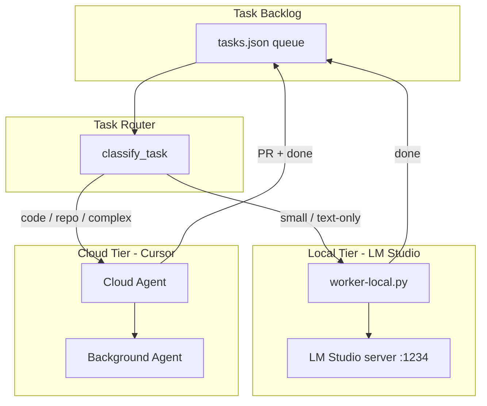

# LM Studio + Cursor: Non-Stop Task Delegation Plan

A practical architecture for running AI continuously on a long task list by splitting work between **Cursor Cloud Agents** (complex, repo-aware work) and **LM Studio** (cheap, fast, local micro-tasks).

---

## Goal

Keep AI working through a backlog without burning cloud credits on trivial work:

| Tier | Engine | Best for |
|------|--------|----------|
| **Cloud** | Cursor Agent / Cloud Agent | Code changes, debugging, multi-file refactors, PRs, repo navigation |
| **Local** | LM Studio (OpenAI-compatible API) | Summaries, formatting, renaming, doc cleanup, classification, draft text |

---

## Architecture



### How the tiers interact

1. **You maintain one task queue** (`tasks/queue.json`) — the single source of truth.
2. **A router classifies each pending task** as `local` or `cloud` (rules below).
3. **Local worker** calls LM Studio directly — no Cursor involved, zero cloud cost.
4. **Cloud worker** launches Cursor Cloud Agents (or uses the desktop Agent) for repo work.
5. **Completed tasks** are archived with output paths; the queue always shows what's next.

---

## Part 1: LM Studio Setup

### 1.1 Install and load a model

1. Install [LM Studio](https://lmstudio.ai/).
2. Download a model suited to your GPU/RAM. Good defaults for micro-tasks:
   - **7B instruct** (e.g. Qwen2.5-7B-Instruct) — fast summaries and formatting
   - **14B+** — better quality for longer documents
3. In LM Studio → **Local Server** tab:
   - Select your model
   - Enable **CORS**
   - Port: `1234` (default)
   - Click **Start Server**

Verify:

```bash
curl http://localhost:1234/v1/models
```

### 1.2 Expose to Cursor (HTTPS tunnel)

Cursor routes chat requests through its backend and requires a **public HTTPS** endpoint for custom models (not raw `localhost` in most setups).

**Option A — ngrok (simplest):**

```bash
ngrok http 1234
# Copy: https://xxxx.ngrok-free.app
```

**Option B — Cloudflare Tunnel (stable URL):**

```bash
cloudflared tunnel --url http://localhost:1234
```

Your Cursor base URL becomes: `https://YOUR-TUNNEL-DOMAIN/v1`

### 1.3 Cursor model configuration

1. **Cursor → Settings → Models**
2. Under **OpenAI API Key**:
   - Enter any non-empty key (e.g. `lm-studio`)
   - Enable **Override OpenAI Base URL**
   - Set URL: `https://YOUR-TUNNEL-DOMAIN/v1`
3. **Add custom model** — use the exact model ID from LM Studio (e.g. `qwen2.5-7b-instruct`)
4. For local-only chat sessions, deselect premium cloud models temporarily.

**Limits to know:**

- **Tab autocomplete** stays cloud-only; local models apply to Chat, Cmd+K, and some Agent flows.
- Toggle the override URL when switching between local and cloud models — Cursor does not auto-route per task today.
- Prompts still pass through Cursor's servers for context assembly; local inference runs on your machine via the tunnel.

---

## Part 2: Task Classification Rules

Use these rules in the router (`scripts/task_router.py`) or manually when triaging:

### Delegate to **LOCAL** (LM Studio)

- Summarize a file or document
- Format markdown (headings, lists, tables)
- Extract action items from notes
- Rename variables/strings in a provided snippet (no repo access)
- Classify or tag tasks (priority, category)
- Draft commit messages from a diff pasted inline
- Spell/grammar pass on prose
- Generate YAML/JSON from a plain-English spec (small outputs)

**Signals:** single file, no git, no tests, output < ~2k tokens, no tool use needed.

### Keep on **CLOUD** (Cursor Agent)

- Edit files in a repository
- Run tests, linters, builds
- Debug with stack traces and codebase search
- Multi-file refactors
- Create branches, commits, PRs
- Install dependencies, configure CI
- Anything requiring terminal, browser, or MCP tools

**Signals:** touches repo, needs verification, ambiguous scope, or chains of dependent steps.

### Decision tree

```
Does the task require reading/writing files in a git repo?
  YES → cloud
  NO → Does it need running commands or tests?
    YES → cloud
    NO → Is expected output < 2000 tokens and well-scoped?
      YES → local
      NO → cloud
```

---

## Part 3: Task Queue (Non-Stop Processing)

### 3.1 Queue file format

Store tasks in `tasks/queue.json`:

```json
{
  "version": 1,
  "tasks": [
    {
      "id": "task-001",
      "title": "Summarize README",
      "type": "summarize",
      "tier": "local",
      "status": "pending",
      "input": { "path": "docs/spec.md" },
      "output": { "path": "tasks/output/task-001-summary.md" },
      "prompt": "Summarize this document in 5 bullet points.",
      "created_at": "2026-07-21T09:00:00Z"
    },
    {
      "id": "task-002",
      "title": "Add error handling to auth module",
      "type": "code",
      "tier": "cloud",
      "status": "pending",
      "input": { "repo": "cursorp1", "paths": ["src/auth/"] },
      "prompt": "Add try/catch around token validation with user-friendly errors.",
      "created_at": "2026-07-21T09:05:00Z"
    }
  ]
}
```

**Status values:** `pending` → `in_progress` → `done` | `failed` | `blocked`

### 3.2 Daily workflow

1. **Morning:** Add all tasks to `queue.json` (or generate from a markdown list).
2. **Start local worker** (runs continuously):

   ```bash
   python scripts/worker-local.py --watch
   ```

3. **Start cloud work** — pick highest-priority `tier: cloud` tasks:
   - Cursor Desktop: Agent mode with the task prompt
   - Cursor Cloud Agents: one agent per independent cloud task (parallel branches)
4. **Review outputs** in `tasks/output/` and merge PRs.
5. **Mark done** — workers update status automatically.

### 3.3 Parallelism strategy

| Resource | Parallelism |
|----------|-------------|
| LM Studio | 1 job at a time (GPU-bound); queue many small tasks |
| Cursor Cloud Agent | 1 agent per independent task/branch |
| You (human) | Review local output while cloud agents run |

Run local worker in a loop overnight for formatting/summary backlog while cloud agents handle code tasks during the day.

---

## Part 4: Local Worker Script

The repo includes `scripts/worker-local.py` which:

1. Reads `tasks/queue.json`
2. Picks the next `pending` task where `tier == "local"`
3. Loads input file content
4. Calls LM Studio at `http://localhost:1234/v1/chat/completions`
5. Writes output and marks task `done`

Run once or in watch mode:

```bash
# Process all pending local tasks
python scripts/worker-local.py

# Poll every 30 seconds
python scripts/worker-local.py --watch --interval 30

# Dry run
python scripts/worker-local.py --dry-run
```

Configure LM Studio connection in `config/lm-studio.env`:

```env
LM_STUDIO_BASE_URL=http://localhost:1234/v1
LM_STUDIO_MODEL=qwen2.5-7b-instruct
LM_STUDIO_MAX_TOKENS=2048
LM_STUDIO_TEMPERATURE=0.3
```

---

## Part 5: Cursor Cloud Agent for Cloud Tasks

For `tier: cloud` tasks, use Cursor's agent capabilities:

### 5.1 Manual (Desktop)

1. Open the repo in Cursor
2. Switch to **Agent** mode
3. Paste the task from `queue.json` including acceptance criteria
4. Let the agent branch, implement, test, and open a PR

### 5.2 Automated (Cloud Agents)

Launch agents from Cursor's cloud UI or API for independent tasks:

- One task → one branch (`cursor/<task-slug>-54dd`)
- Agent reads the prompt, implements, pushes, opens draft PR
- You review PRs in batch

**Tip:** Group cloud tasks by repo and dependency order. Task B that depends on Task A's PR should stay `blocked` until A merges.

### 5.3 Cursor Automations (optional)

If you use Cursor Automations, trigger a cloud agent when:

- A new GitHub issue is labeled `agent`
- A task in `queue.json` is marked `tier: cloud` and `status: pending`

This closes the loop for hands-off processing.

---

## Part 6: Prompt Templates for Local Tasks

Store reusable prompts in `tasks/prompts/`:

**summarize.md**

```
Summarize the following document concisely.
- Use markdown bullet points
- Max 8 bullets
- Include one-line "Key takeaway" at the top

---
{content}
```

**format-markdown.md**

```
Clean up this markdown without changing meaning:
- Fix heading hierarchy (single H1)
- Normalize list formatting
- Add blank lines between sections
- Do not add new content

---
{content}
```

**extract-actions.md**

```
Extract action items from this text.
Output a markdown checklist. Each item: verb-first, specific, assignable.

---
{content}
```

The local worker loads the template matching `task.type` and substitutes `{content}`.

---

## Part 7: Cost and Performance Tips

1. **Batch local tasks** — LM Studio loads the model once; run 20 summaries in one session.
2. **Use low temperature (0.2–0.4)** for formatting and extraction; higher only for creative drafts.
3. **Don't local-delegate code edits** — a 7B model will hallucinate APIs; cloud agents have repo context.
4. **Keep tunnel alive** — use `ngrok config` or Cloudflare named tunnels so Cursor doesn't break mid-session.
5. **Model switching** — use a small fast model for summaries; swap to a larger model in LM Studio only when quality drops.
6. **Track spend** — cloud tasks in a spreadsheet; local tasks are electricity only.

---

## Part 8: Recommended Folder Layout

```
cursorp1/
├── config/
│   └── lm-studio.env          # Local API settings
├── docs/
│   └── lm-studio-cursor-delegation-plan.md
├── scripts/
│   ├── worker-local.py        # LM Studio task runner
│   └── task_router.py         # Auto-classify tier
├── tasks/
│   ├── queue.json             # Master task list
│   ├── backlog.md             # Human-friendly intake list
│   ├── output/                # Local task results
│   └── prompts/               # Reusable prompt templates
└── README.md
```

---

## Part 9: Getting Started Checklist

- [ ] LM Studio installed, model downloaded, server running on `:1234`
- [ ] ngrok or Cloudflare tunnel exposing HTTPS `/v1` endpoint
- [ ] Cursor configured with custom model + override base URL
- [ ] Verified local chat hits LM Studio logs
- [ ] `tasks/queue.json` created with 3–5 test tasks (mix of local + cloud)
- [ ] `python scripts/worker-local.py` completes a summarize task
- [ ] One cloud task completed via Cursor Agent with PR
- [ ] Review workflow: local outputs in `tasks/output/`, cloud via PRs

---

## Part 10: Example 24-Hour Run

| Time | Action |
|------|--------|
| T+0 | Add 30 tasks to backlog (10 cloud, 20 local) |
| T+5m | Start `worker-local.py --watch` |
| T+10m | Launch 2 Cloud Agents on independent cloud tasks |
| T+1h | Review 8 local summaries, merge 1 PR |
| T+4h | Local worker finishes formatting backlog |
| T+8h | Cloud agents complete 6 PRs; mark queue |
| Overnight | Local worker processes remaining text tasks |
| Next AM | Batch-review PRs + local outputs |

---

## Troubleshooting

| Problem | Fix |
|---------|-----|
| Cursor can't reach LM Studio | Check ngrok URL ends with `/v1`; confirm server is running |
| "Invalid model" in Cursor | Use exact model ID from `GET /v1/models` |
| Local worker timeout | Increase `LM_STUDIO_MAX_TOKENS` or use smaller input |
| Cloud agent stuck | Split task; mark dependency as `blocked` |
| Mixed local/cloud confusion | Toggle Override Base URL in Cursor settings per session |

---

## Next Steps

1. Populate `tasks/backlog.md` with your real task list.
2. Run `python scripts/task_router.py tasks/backlog.md` to auto-tag tiers.
3. Start the local worker and your first Cloud Agent.
4. Iterate on prompt templates in `tasks/prompts/` for your common micro-tasks.
